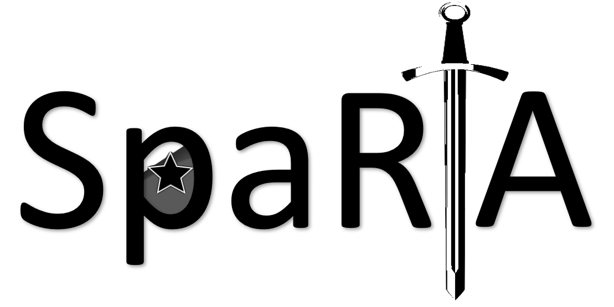

<div align="center"></div> 

# SpaRTA
This repo contains the code of our paper  [Sparsity May Be All You Need: Sparse Random Parameter Adaptation](https://arxiv.org/pdf/2502.15975).

## Overview
SpaRTA is a new PEFT technique for adapting LLMs to domain-specific tasks that makes the resulting adapters easy to merge. 

- It works by randomly choosing a very small number of scalar parameters to be updated during training, resulting in real memory saving and higher speeds during training

- It performs competitively with LoRA

- It allows for easier merging by minimizing parameter interference


## Installation
```bash

```
## Usage

```python

```

## Contributing

## Citation
```bibtex
@article{rios2025sparsity,
  title={Sparsity may be all you need: Sparse random parameter adaptation},
  author={Rios, Jesus and Dognin, Pierre and Luss, Ronny and Ramamurthy, Karthikeyan N},
  journal={arXiv preprint arXiv:2502.15975},
  year={2025}
}
```
